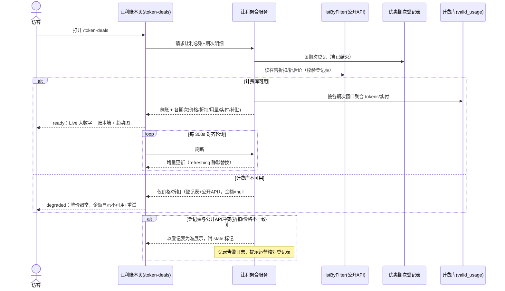

# 功能模块 PRD · Token 优惠模块（Subsidy Ledger / 让利账本）

## 文档信息

- **关联产品/模块：** ZenMux Arena（线上主页 <https://arena.zenmux.ai>）· 根下**独立实验**，与 Token Economics 平级；建议路由 `/token-deals`（含 `/token-deals/about`），命名可在评审时调整
- **作者：** thinkthinking
- **状态：** 草稿（设计输入版）
- **关联链接：**
  - 线上环境主页：<https://arena.zenmux.ai>（首页 Experiments 卡片墙，本实验的发现入口）
  - 设计与数据范式参照：Token Economics（<https://arena.zenmux.ai/token-economics>）——`src/app/token-economics/`（视图层）、`research/token-economics/`（数据逻辑层）
  - About 页先例：`/token-economics/about`（origin story + `AuthorCard`，作者同为 thinkthinking）
  - Live 数据管线：`src/app/api/token-economics/live/route.ts` + `research/token-economics/live-query.ts`
  - 折扣锚定配置先例：`config/token-economics-live-models.json`
  - 相关工具先例：`/tools/discount-to-deepseek`（锚定折扣计算器）
  - 引流目标站：ZenMux 主站模型详情页，URL 形如 <https://zenmux.ai/z-ai/glm-5.2>（`zenmux.ai/<模型 slug>`）

## 变更记录

| 日期       | 版本 | 维护人                                                               | 关键改动                                                                                                                                                                                                                                            |
| ---------- | ---- | -------------------------------------------------------------------- | --------------------------------------------------------------------------------------------------------------------------------------------------------------------------------------------------------------------------------------------------- |
| 2026-07-03 | v1.2 | thinkthinking <yezhenjie@outlook.de> ＋ Claude (vibe-product-design) | 按发起人反馈重画图 4/图 5 为公开单页布局（无侧栏/无后台/无登录态）；4.1 ⑤ 明确已结束优惠与进行中优惠同页对所有人展示，"归档"仅为视觉状态                                                                                                            |
| 2026-07-03 | v1.1 | thinkthinking <yezhenjie@outlook.de> ＋ Claude (vibe-product-design) | 定位改为 arena.zenmux.ai 根下独立实验（路由 `/token-deals`，不再是 Token Economics 的 Tab）；全卡外链跳 zenmux.ai 模型详情页引流（规则 8 + TDS-11）；新增 About 页（学习 economics 先例，作者 thinkthinking，TDS-12 + 图 6）；重画图 1 为独立页导航 |
| 2026-07-03 | v1.0 | thinkthinking <yezhenjie@outlook.de> ＋ Claude (vibe-product-design) | 初始版本：完整初稿 + 高保真原型图 + 图文互检修订                                                                                                                                                                                                    |

## 1. 背景与目标

### 1.1 需求背景

ZenMux 正在对一批国产/开源旗舰模型做**限时价格补贴**（打折让利）：平台以低于上游原价的价格向开发者供给 token，差价由 ZenMux 承担。这个事实目前散落在各处，没有一个页面把它讲成一个完整的故事：

- **数据已经存在但没被利用。** ZenMux 前端 API `listByFilter` 已返回每个模型的 `pricing_discount`（折扣系数，如 `0.307271` ≈ 3.1 折）和折后净价 `pricing_prompt` / `pricing_completion`——截至 2026-07-03 实测有 **18 个模型**带有折扣系数（GLM-5.2 打 3.1 折、Qwen3.7-Max 打 1.7 折、MiniMax M3 打 4.6 折等），但现有 Token Economics 榜单管线在 `scrape.ts` 解析时丢弃了该字段。
- **Live 管线已经能算钱。** 现有 LIVE 视图（DeepSeek Kill-Line Challenge）已经从计费库 `valid_usage` 聚合出每模型的实付 cost（`bill_amount`）与 token 时间序列——有了折扣系数，**补贴额 = 实付 × (1/折扣 − 1)** 一步可得。
- **对外没有"让利"叙事。** 用户在模型列表看到低价，但感知不到"这是补贴价、平台在替你掏钱"；对内，运营/管理层也没有一个随时可看的"累计补贴了多少钱"的账本。

本需求由产品发起人（本仓库 owner）提出，核心诉求原话：**"告诉用户，我们让利了多少！以及也让我们知道我们补贴了多少。"**

### 1.2 目标

做一个「Token 优惠 / 让利账本」页面，一份数据、两个受众，可衡量的成功标准：

1. **对外（主叙事）**：访客打开页面 3 秒内能看到一个 Live 跳动的**"累计让利总额 $X"**大数字，以及每个在售优惠模型的"原价 → 现价 → 你省了多少"账本行。页面可被截图/分享用于营销传播（复用 `ChartFrame` 的导出 PNG 能力）。
2. **对内（副产品）**：同一页面即回答运营三问——当前有几个优惠在跑、每个优惠累计补贴了多少美元、补贴换来了多少 token 用量——不需要另开内部报表。
3. **数据完整性**：**已结束的优惠不消失**——归档展示其完整周期的用量、实付、补贴总额，让"历史让利"可累加进总账。
4. **独立实验定位**：本模块是 <https://arena.zenmux.ai> 根下的独立实验（路由 `/token-deals`），上线后进入首页 Experiments 卡片墙，与 Token Economics（`/token-economics`）、Who Are You（`/who-are-you`）并列可发现——不挂在任何既有实验之下。
5. **为主站引流**：页面上出现的**每一个模型**（进行中卡、已结束卡、趋势图系列）都可点击跳转 ZenMux 主站对应模型详情页（`https://zenmux.ai/<模型 slug>`，如 <https://zenmux.ai/z-ai/glm-5.2>），把"看到补贴"转化为"去用模型"；引流点击可通过 UTM 参数在主站侧归因。
6. **有 About 页**：`/token-deals/about` 讲清楚实验缘起与补贴口径方法论，附作者卡片（thinkthinking），与 `/token-economics/about` 同范式。

### 1.3 非目标 / 明确不做

- **不做优惠的发放/领取/核销**——这是纯展示与统计页面，不改变任何计费行为。
- **不做用户级/账户级的"你个人省了多少"**——本期只做平台级总账与模型级分账（用户级需要登录态与账单权限，超出 Arena 静态站定位）。
- **不做补贴预算管理/预警**（预算上限、烧钱速率告警）——列入后续迭代候选（见第 9 章）。
- **不做上游成本核算**——"补贴额"的口径是 _牌面原价 − 折后价_（用户视角的让利），不是 ZenMux 与上游的实际结算成本差（那是财务口径，数据不在本仓库可及范围内）。
- **不改动 Token Economics 模块的任何代码与视图**——本实验是独立路由，只**借鉴**其设计范式与数据管线模式（视觉体系、Live 轮询、baseline 预聚合），共享代码如何提取/复制由研发判断，产品要求仅为"视觉与交互一致、互不影响"。

## 2. 范围与约束

### 2.1 影响范围

| 类型 | 对象                                                         | 变化                                                                                          |
| ---- | ------------------------------------------------------------ | --------------------------------------------------------------------------------------------- |
| 新增 | 独立实验路由 `/token-deals`（让利账本主页）                  | arena.zenmux.ai 根下新页面，与 `/token-economics` 平级                                        |
| 新增 | About 页路由 `/token-deals/about`                            | 实验缘起 + 补贴口径方法论 + 作者卡片（thinkthinking），范式同 `/token-economics/about`        |
| 新增 | 本实验自有顶部导航（借鉴 `TokenEconNav` 范式）               | 左 ZenMux 字标回 arena 首页；右侧 `DEALS · ABOUT` 两个 tab + GitHub / zenmux.ai 外链          |
| 新增 | 优惠期次登记表（运营维护的配置文件）                         | 记录每期优惠的模型、原价、折扣、起止日期（含已结束期次）                                      |
| 新增 | 让利数据接口（Live 聚合）                                    | 按优惠期窗口聚合用量/实付/补贴的接口（管线范式复用 token-economics live，代码独立）           |
| 新增 | 全站模型详情页外链                                           | 页面上每个模型均链接 `https://zenmux.ai/<slug>`（新窗口 + UTM），为主站引流                   |
| 改动 | 首页 `src/lib/experiments.ts` / `page.tsx`                   | Experiments 注册表加一条实验卡（`href: /token-deals`，含"累计让利"mini 指标）                 |
| 不动 | Token Economics 模块全部代码（`src/app/token-economics/**`） | 零改动——本实验只借鉴其范式，不动其导航、视图与数据解析（`pricing_discount` 由本实验自行读取） |

涉及角色：**访客**（无登录，读）、**运营/维护者**（改优惠登记表）、**产品发起人**（验收总账口径）。

### 2.2 前置依赖

| 依赖                                                                               | 用途                                                       | 不满足时                                                      |
| ---------------------------------------------------------------------------------- | ---------------------------------------------------------- | ------------------------------------------------------------- |
| ZenMux `listByFilter` 接口的 `pricing_discount` + `pricing_prompt/completion` 字段 | 当前在售优惠的折扣系数与折后价（原价 = 折后价 ÷ 折扣系数） | 无法自动发现在售优惠；退化为纯登记表驱动                      |
| 计费库 `valid_usage`（现有 Live 管线的 DB 连接，env `TOKEN_ECON_LIVE_DB_*`）       | 按优惠窗口聚合 tokens / 实付 cost / 请求数                 | 补贴额无法 Live 计算；页面显示登记表静态信息 + "数据暂不可用" |
| 优惠期次登记表（运营维护，含起止日期与期内价格快照）                               | 已结束优惠的存档与窗口边界；API 只反映"现在"，历史必须登记 | 已结束优惠无法展示，总账只含进行中期次                        |
| 现有 Live 基线预聚合机制（`precompute-live.ts` + 部署 skill `morphe-economics`）   | 冷启动秒开、避免全量扫库                                   | 首屏聚合慢（可接受降级）                                      |

### 2.3 假设与约束

- `[假设]` **`pricing_discount` 的语义是"用户支付比例"**（0.307 = 付 3 折、平台贴 69.3%），且 `pricing_prompt/completion` 已是折后净价（`scrape.ts` 注释佐证："already the net, post-discount price"）。**上线前需与 ZenMux 后端确认**该语义；若语义相反（表示"折掉的比例"），所有补贴公式取补数即可，页面结构不变。
- `[假设]` 折扣对 input 与 output 价格**同系数生效**（实测 doubao-seed-2.1-pro 的 prompt/completion 与其原价比值一致，支持该假设）。若某期次两边系数不同，登记表按 input/output 分别记原价即可覆盖。
- 核心定位以**对外营销为主、兼顾内部核算**——已由发起人 v1.1 需求确认（独立实验 + 全站模型外链为主站引流），不再是假设。
- 硬约束：延续 Token Economics 的技术与视觉体系——Next.js 16 / React 19、`lib.ts` 终端账本视觉（Space Mono、INK/PAPER 配色、无圆角硬边框）、手绘 SVG 图表（不引入图表库）、仅亮色模式。
- 硬约束：页面公开无鉴权，**不得泄露内部敏感数据**——`valid_usage` 聚合结果只暴露模型级汇总（tokens/cost/requests），不含任何用户/请求明细；补贴额是由公开牌价推导的衍生数，可公开。
- 约束：优惠期窗口按 **UTC 日期**界定（与 Live 管线现有时间桶口径一致），避免时区歧义。

## 3. 用户与场景

### 3.1 目标用户

1. **ZenMux 现有/潜在开发者用户**（主受众）：用 API 跑模型的工程师，价格敏感，想知道"现在薅哪个模型最划算、能省多少"。
2. **ZenMux 运营/管理层**（副受众）：想随时知道"补贴了多少钱、换来多少用量、哪期优惠效果最好"。
3. **行业观察者/传播节点**：看到"累计让利 $X"的大数字截图后转发，为 ZenMux 带来品牌曝光。

### 3.2 典型使用场景 / 用户故事

1. **比价捡漏 → 引流转化**：开发者听说 GLM-5.2 在打折，打开 `arena.zenmux.ai/token-deals`，看到"原价 $4.56/M → 现价 $1.40/M，3.1 折，已为用户省下 $XX"，点击卡片跳转 <https://zenmux.ai/z-ai/glm-5.2> 模型详情页，直接开始接入——这是本页最重要的转化路径。
2. **营销传播**：运营同学要发一条"ZenMux 已累计让利 $X"的推文，打开页面截图 Live 大数字与账本墙（或用导出 PNG），数字实时可信。
3. **内部周会**：管理层问"补贴烧了多少"，运营打开 DEALS 视图，读出总账三数：累计补贴 $X / 优惠期用量 Y tokens / 进行中 N 期，并展开某一期看趋势。
4. **历史复盘**：某期优惠结束一个月后，运营回看该期归档卡：期次总用量、总实付、总补贴、日均补贴曲线，评估"补贴换增长"的效率。
5. **边缘场景**：计费库暂不可达时，访客仍能看到在售优惠的价格与折扣（来自公开 API/登记表），只是 Live 金额显示为不可用态。

## 4. 交互设计与产品原型

> 本章给 UI/UX 设计师：整体延续 Token Economics 的"终端账本野兽派"视觉（Space Mono 等宽、`#141414` 墨色硬边框、`#f4f1ea` 纸色底、绿 `#1a8a4a` = 省钱/正向、红 `#cf3636` = 原价/划掉），但这是 arena.zenmux.ai 根下的**独立实验页**（`/token-deals`），拥有自己的顶部导航与 About 页。

### 4.1 关键交互流程说明

页面自上而下四段式，一屏讲完主叙事，下滚看明细：

**① 顶部导航（自有导航，借鉴 `TokenEconNav` 范式）**
sticky 顶栏：左侧 ZenMux 字标（`/maker-logo/ZenMux-Light.png`）点击回 arena 首页；右侧大写等宽 tab `DEALS · ABOUT`（active 态反白胶囊），外加 GitHub mark 与 zenmux.ai 外链——结构与 `TokenEconNav` 一致，但 tab 集合只属于本实验。页面 URL 为 `/token-deals`，About 为 `/token-deals/about`，均为独立路由（不是 `?view=` 查询参数）。

**② Hero 总账区（Live 大数字）**

- 主数字：**「TOTAL SAVED FOR DEVELOPERS · 累计让利」`$X,XXX,XXX`**——所有期次（进行中 + 已结束）的补贴额总和，随 Live 轮询刷新；数字旁一枚脉冲圆点（复用 `te-live-pulse`）标示 LIVE。
- 主数字下一行小字注明口径："= Σ 优惠期内用量 × (原价 − 折后价)，按牌面价差计，非财务结算口径"。
- 副指标行（4 枚 `StatBox`，复用现有组件）：
  1. **ACTIVE DEALS**——进行中优惠期次数（如 `18`）；
  2. **AVG DISCOUNT**——进行中期次的平均折扣（按补贴额加权，如 `x0.42`，副注"≈ 58% subsidized"）；
  3. **TOKENS ON DEAL**——优惠期内累计 token 用量；
  4. **DEVELOPERS PAID**——优惠期内用户实付总额（与补贴额对照，形成"你付 $1、我们贴 $Y"的杠杆叙事）。
- 刷新机制与 LIVE 视图一致：客户端对齐边界轮询（默认 300s）、手动 Refresh 按钮、`loading` / `refreshing` 双态。
- Hero 区（或页面页脚）常驻一行**最近更新时间**（如 "Live data · updated 2 min ago"）——不只降级态才有时间戳，ready 态也要给访客一个数据新鲜度锚点。

**③ 进行中优惠账本墙（ACTIVE 区）**

- 每个在售优惠模型一张**账本卡**，网格排布（桌面 3 列）。卡片信息结构（自上而下）：
  1. 厂商 logo（`VendorGlyph`）+ 模型名 + `LIVE` 绿色角标；
  2. **价格账本行**：`INPUT $4.56 → $1.40 /M`、`OUTPUT $14.32 → $4.40 /M`——原价用红色删除线，现价用绿色加粗（沿用 `PriceLedgerRow` 范式）；
  3. **折扣徽章**：`x0.31`（等宽大号），旁注中文习惯表达 `3.1 折`，以及**补贴率** `ZenMux 补贴 69%`；
  4. **期内三数**：`USED 130.5B tokens` / `PAID $12,340` / `SAVED $27,890`（SAVED 绿色强调，是卡片第二视觉焦点）；
  5. 优惠起始日期 + "since" 字样；**整卡可点击**跳转 ZenMux 主站模型详情页 `https://zenmux.ai/<模型 slug>`（如 GLM-5.2 → <https://zenmux.ai/z-ai/glm-5.2>），新窗口打开、附 UTM 引流参数（规则 8）；卡片右下角常驻外链箭头图标明示可点。
- 默认按 **SAVED（累计补贴额）降序**排列；提供排序切换：SAVED / DISCOUNT（折扣最狠优先）/ USED / 最新开始。
- 折扣极浅的期次（如 x0.95）照常展示不隐藏——账本要完整；视觉上折扣徽章的强调色仅在 `x ≤ 0.5` 时启用（更狠的折才配更响的视觉）。

**④ 趋势图区（SUBSIDY OVER TIME）**

- 一张手绘 SVG 折线/面积图：X 轴时间（支持 `ALL / 72H` 范围切换，与 LIVE 视图一致），Y 轴可切 **SAVED $**（默认）/ **TOKENS** / **PAID $**；每个优惠模型一条**累计值**序列（单调上升，传达"让利持续累积"），底部系列开关（复用 LIVE 视图的 series toggle 范式）。
- 折线终点带 Live 脉冲点；悬停显示当日各模型明细 tooltip。
- 图表包在 `ChartFrame` 内，支持一键导出 PNG（营销素材出口）。

**⑤ 已结束优惠区（ENDED 区）——与进行中优惠同页展示，没有"后台"概念**

- **就在同一个公开页面上**，紧随 ACTIVE 卡墙之后向下排布（访客下滚即见）；本页无登录态、无管理界面，已结束优惠对所有人可见——"归档"只是视觉降饱和的展示状态，不是移入任何后台。
- 区段标题 `ENDED DEALS · 已结束`，副注"已结束优惠的让利仍计入总账"；视觉降饱和（行/卡底色转灰纸 `#eceae3`、logo 保持彩色、`ENDED` 灰色角标 + 起止日期区间）。
- 卡片结构与 ACTIVE 卡一致，但三数为**定格终值**（期次结束时刻的总用量/总实付/总补贴），不再轮询变化；价格行展示当期的原价 → 折后价快照。
- 已结束期次的补贴额**计入顶部总账**——归档不出账。
- 默认收起为紧凑列表（每期一行：模型 / 折扣 / 周期 / 总补贴），点击行展开为完整卡片，避免历史期次增多后页面无限变长；列表底部一行计数（"共 N 条已结束优惠"）。
- 归档区原价删除线用**灰色**而非红色（红删除线是进行中优惠的"活对照"，归档只陈述事实不再制造张力）。
- 已结束卡的模型名/展开卡**同样外链**到模型详情页（模型还在售，只是优惠结束——引流不因归档而中断；若模型已下架见 5.4）。

**⑥ About 页（`/token-deals/about`）**

- 范式完全学习 `/token-economics/about`：同一顶部导航（ABOUT tab active）、居中窄栏（max-w-2xl）等宽排版、顶部"横线 · ZenMux 字标 · 横线"的 masthead。
- 内容三段：
  1. **缘起故事**：为什么做让利账本——ZenMux 在补贴一批旗舰模型，我们想把"让利了多少"变成一个透明、实时、可验证的公开数字；
  2. **口径方法论**：用通俗语言讲清补贴的计算方式（原价 − 折后价 × 用量、牌面价差 ≠ 财务结算、数据来自计费库聚合与公开牌价）——这是页面可信度的背书，正文中提到的模型同样外链详情页；
  3. **作者卡片**：复用 `AuthorCard` 范式（作者 **thinkthinking**，X / 小红书二维码 / WeChat / email，"Get in Touch"）。

**状态机（页面数据态）**
`loading（骨架屏，复用 LiveSkeletonChart 范式）→ ready（全量渲染）→ refreshing（数据静默更新，右上角旋转指示）→ degraded（计费库不可用：价格/折扣照常显示，金额区显示 "— LIVE DATA UNAVAILABLE"，自动退避重试）`。

### 4.2 高保真原型图

（原型图存于同目录 `assets/`，平台 web / PC 2K，风格按项目配置（Apple HIG）生成。**给设计师的重要提示**：原型图表达的是**信息架构、内容结构与交互状态**；最终视觉请按 4.3 节切换回 Token Economics 同款"终端账本"体系（等宽字体、硬边框、纸色底）。布局基准以 4.1 为准：本模块是 arena.zenmux.ai 根下的**公开独立单页**（顶部横向导航 `DEALS · ABOUT`，无登录态、无任何后台界面），已结束优惠与进行中优惠在同一页面对所有人展示——图 1/4/5/6 已按此布局绘制；仅图 3 的多 tab 导航样式过时，以文字为准。旧方案图（v1.0 的 Tab 版图 1、后台版图 4/5）以 `.v1-*存档.png` 留存于 assets，均已废弃。）

#### 图 1 · 让利账本主页 · 默认态全貌

- **这是什么：** `/token-deals` 的首屏默认态，页面主叙事一屏呈现。
- **关键元素：** 本实验自有顶部导航（左 ZenMux 字标，右 `DEALS · ABOUT` 两 tab，DEALS 反白 active）；Hero 大数字 "$1,284,530" 带 LIVE 绿点与口径小字（"= Σ 优惠期内用量 × (原价 − 折后价) · 按牌面价差计"）；4 枚统计卡（ACTIVE DEALS 18 / AVG DISCOUNT x0.42 ≈58% subsidized / TOKENS ON DEAL 162.4B / DEVELOPERS PAID $586,210）；"进行中优惠"卡墙 3 列 6 卡（GLM-5.2、Qwen3.7-Max、MiniMax M3、Kimi K2.7 Code、ERNIE 5.1、LongCat-2.0），每卡右下角外链箭头。
- **关键设计决策：** 大数字是页面唯一的超大号元素（信息层级压倒一切）；绿色只用于"省下的钱"与 LIVE，红色只用于"被划掉的原价"——颜色即语义；每张卡都是通往 zenmux.ai 模型详情页的引流入口。
- **交互说明：** 大数字随 300s 轮询刷新；卡片 hover 抬升边框加粗；点卡片新窗口跳 `https://zenmux.ai/<slug>`（附 UTM）。
- **图与文不一致处（以文为准）：** 图中价格与三数为示意数据，实际来自登记表与计费聚合（折扣徽章各模型不同这一点图已正确表达）。（v1.0 的 Token Economics Tab 方案旧图存档于 `assets/01-deals-默认态全貌.v1-tab方案存档.png`，已废弃。）

#### 图 2 · 优惠账本卡（ACTIVE）特写

- **这是什么：** 单张进行中优惠卡的组件级特写（以 GLM-5.2 为例）。
- **关键元素：** 厂商 logo + 模型名 + LIVE 角标；INPUT/OUTPUT 两行价格账本（红删除线原价 → 绿现价）；`x0.31 / 3.1 折` 折扣徽章 + "ZenMux 补贴 69%"；USED / PAID / SAVED 三数行；since 日期。
- **关键设计决策：** "SAVED $" 是卡内第二焦点（绿色加粗），让每张卡都在重复主叙事"我们在替你掏钱"；原价必须可见且被划掉——没有原价对照，折扣就没有说服力；折扣徽章绿描边为 `x ≤ 0.5` 的强调态（5.2 规则 6）。
- **交互说明：** 整卡可点（外链，右下角外链箭头暗示）；折扣徽章 hover 显示 tooltip 解释补贴换算公式。
- **图与文不一致处（以文为准）：** 图中厂商 logo 为示意的 "Z" 圆标——实际用 `public/model-logo/` 下 GLM 的品牌 logo；USED 数值下的 "tokens" 单位小字是原型新增的好细节，采纳进设计。

#### 图 3 · 补贴趋势图（SAVED $ 视角）

- **这是什么：** 页面第 ④ 段的 SUBSIDY OVER TIME 图表区，Y 轴处于默认的 SAVED $ 档，范围 ALL 选中。
- **关键元素：** 多序列累计折线/面积图（6 个模型各一色）；Y 轴档位分段控件（SAVED $ / TOKENS / PAID $）；范围切换（ALL / 72H）；导出 PNG 按钮；悬停 tooltip（"2026-06-28 · GLM-5.2 · SAVED $3,420 · 42.1B tokens"）；底部模型系列开关（图中 ERNIE 5.1 处于关闭态示范）；每条折线终点 Live 发光点；左下角"Live data · Updated just now"新鲜度标注。
- **关键设计决策：** 默认 Y 轴是"补贴金额"而非 token——本模块的差异化就在于把用量翻译成钱的故事；曲线是**累计值**（单调上升），传达"让利在持续累积"。
- **交互说明：** 悬停出当日明细 tooltip；系列开关点选后曲线即时增减；切范围命中前端缓存秒显。
- **图与文不一致处（以文为准）：** 图中顶部导航画成了多 tab 控制台样式，实际为本实验自有导航（仅 `DEALS · ABOUT`）；图中 X 轴延伸到了未来日期（2026-07-31），实际以当前时间为右边界；图例中的模型名同样外链模型详情页。

#### 图 4 · 已结束优惠区（与进行中优惠同页）

- **这是什么：** 公开页 `/token-deals` **向下滚动后的画面**——上方还能看到进行中卡墙的末行（ERNIE 5.1 / LongCat-2.0，带 LIVE 角标），紧接着就是第 ⑤ 段 ENDED DEALS 区：已结束优惠与进行中优惠在**同一个公开页面**连续展示，所有访客可见，没有后台。
- **关键元素：** 同款顶部导航（DEALS active，sticky）；区段标题 `ENDED DEALS · 已结束` + 副注"已结束优惠的让利仍计入总账"；4 条紧凑行（logo / 模型名 / 灰描边折扣徽章 x0.48–x0.66 / 起止区间 / 右对齐 SAVED 终值 / 展开 chevron / 外链箭头）；第 2 行（Step 3.7 Flash）展开态：ENDED 灰角标、当期价格快照（原价**灰色**删除线）、定格三数（SAVED 深灰加粗、无绿色）；底部"共 4 条已结束优惠"计数。
- **关键设计决策：** 进行中与已结束同页上下相邻，用降饱和（灰徽章、灰删除线、无 LIVE、无绿色）区分状态而不是用页面隔离；**数字不降级**——"故事结束了，账还在"；紧凑列表 + 单行展开控制页面长度。
- **交互说明：** 点击紧凑行展开/收起完整卡；行尾外链箭头跳对应模型详情页（引流不因优惠结束而中断）；展开卡无 LIVE 脉冲与轮询语义。
- **图与文不一致处（以文为准）：** 图中进行中卡的价格账本被简化成单行——实际按 4.1 ③ 为 INPUT/OUTPUT 两行；所有金额为示意数据。

#### 图 5 · 降级态（计费库不可用）

- **这是什么：** 公开页 `/token-deals` 的 `degraded` 状态——价格与折扣照常展示，Live 金额不可用；页面骨架与默认态（图 1）完全一致。
- **关键元素：** 同款顶部导航（DEALS active）；导航下方浅黄警示带（感叹号 + "实时数据暂不可用 · Live data unavailable — 正在自动重试" + 右侧 Retry 文字按钮）；Hero 大数字位置显示 `— LIVE DATA UNAVAILABLE` + "上次成功更新 2026-07-03 09:42 UTC"、无 LIVE 绿点；4 枚统计卡中牌价类（ACTIVE DEALS 18 / AVG DISCOUNT x0.42）正常、金额类（TOKENS ON DEAL / DEVELOPERS PAID）显示 `—`；优惠卡（GLM-5.2 / Qwen3.7-Max / MiniMax M3）价格账本与折扣徽章完整、三数行为 `—`、无 LIVE 角标、右下角外链箭头仍在。
- **关键设计决策：** 降级不清空页面——公开牌价信息（原价/现价/折扣）与 Live 金额解耦，比价与跳转模型详情页（引流）任何时候可用；警示带克制且可操作。
- **交互说明：** 警示带内提供手动 Retry；客户端 10s 退避自动重试；恢复后无刷新回到 ready 态；卡片外链在降级态照常可点。
- **图与文不一致处（以文为准）：** 图中出现的 "View all deals" 链接不在本期范围（进行中优惠全部平铺展示，无二级列表页）；卡内补贴率徽章的摆放与统计卡顺序为示意，以 4.1 的信息结构为准。

#### 图 6 · About 页（/token-deals/about）

- **这是什么：** `/token-deals/about`——实验缘起、口径方法论与作者卡片，本模块的可信度背书页。
- **关键元素：** 同款顶部导航（ABOUT tab 反白 active）；"横线 · ZenMux 字标 · 横线" masthead；两个阅读小节——"WHY WE BUILT THIS · 为什么做让利账本"（正文中 GLM-5.2 为下划线外链）与 "HOW WE COUNT · 补贴怎么算"（居中公式行 `SAVED = 优惠期内用量 × (原价 − 折后价)` + 灰色口径脚注"按牌面价差计 · 非财务结算口径"）；底部 "GET IN TOUCH" 作者卡片（**thinkthinking** · Author · ZenMux Arena，X / 小红书二维码 / WeChat / Email 四联系位）。
- **关键设计决策：** 与数据密集的主页形成对比的"安静编辑页"——窄栏居中、宽行距，先讲为什么、再讲怎么算、最后是谁在做，公式明示是页面数字可信的关键；范式与 `/token-economics/about` 完全一致（复用其 masthead 与 `AuthorCard` 结构）。
- **交互说明：** 正文模型名外链对应 zenmux.ai 详情页（带 UTM）；小红书二维码可扫（实现沿用 about 先例的服务端 QR 生成）；X/WeChat/Email 各自跳转或复制。
- **图与文不一致处（以文为准）：** 图中头像为示意；联系方式的具体 handle/邮箱以 `AuthorCard` 现有配置为准，勿按图中示意文案实现。

### 4.3 与现有设计规范的一致性

- **借鉴范式（组件属于 token-economics 目录，提取共享还是复制由研发定，产品只要求视觉一致）**：`TokenEconNav` 的导航结构（本实验自有 nav 只含 `DEALS · ABOUT`）、`StatBox` / `VendorGlyph` / `ModelPill`（`components.tsx`）、`ChartFrame`（导出 PNG）、`lib.ts` 全套配色/格式化器（`usd`、`perM`、`tokens`）、`LiveSkeletonChart` 骨架范式、`te-live-pulse` 脉冲动画、LIVE 视图的轮询/缓存/系列开关交互范式、`PriceLedgerRow` 的"原价→现价"账本行范式、About 页的 masthead + `AuthorCard` 范式。
- **新增（需设计师出）**：优惠账本卡（ACTIVE/ENDED 两态，整卡外链）、折扣徽章 + 补贴率组合件、ENDED 紧凑行/展开卡切换、降级警示带。
- 全部沿用无圆角硬边框、等宽字体、仅亮色的既有体系，不引入新色板（ENDED 灰纸底 `#eceae3` 从 PAPER 色阶内取）。
- **首页入口卡**：`src/lib/experiments.ts` 注册一条实验（`status: "live"`、`href: "/token-deals"`），卡片主题可复用 `ledger` 金融账本皮或新增专属 theme，mini 指标行展示"累计让利 $X"。

## 5. 业务逻辑与流程

> 本章给研发：讲清规则与口径，实现方式（表结构/接口协议）自行判断。

### 5.1 核心流程图

### 5.2 业务规则详解

**规则 1 · 优惠期次（Deal）的定义与生命周期**

- 一个"期次"= `(模型 slug, 原价 input/output, 折扣系数, startDate, endDate|null)` 的一条登记记录。`endDate = null` 表示进行中。
- 同一模型可以有多个先后期次（如先打 5 折、后改 3 折 → 两条期次记录，各自窗口独立核算），期次窗口**不允许重叠**（登记校验规则）。
- 状态机：`scheduled（startDate 在未来，本期不展示，仅登记）→ active（今日 ∈ [startDate, endDate|∞]）→ ended（今日 > endDate）`。触发流转的唯一事件是 UTC 日期跨越边界，无人工操作态。

**规则 2 · 在售优惠的发现与校验（登记表为主、API 为证）**

- 登记表是**期次事实的唯一权威**（因为 API 无历史）；`listByFilter` 的 `pricing_discount` 用于：① 辅助运营发现"API 有折扣但登记表漏登"的模型（差异提示，不自动建期次）；② 校验进行中期次的折扣/折后价是否与线上一致，不一致时页面以登记表为准并打 `stale` 标记、记告警。

**规则 3 · 补贴额（SAVED）计算口径**

- 原价还原：`origInput = pricing_prompt ÷ pricing_discount`（登记时固化进期次记录，展示时不再动态除）。
- 期内补贴额 `SAVED = Σ日 [ inputTokens×(origInput−newInput) + outputTokens×(origOutput−newOutput) ] ÷ 1e6`。
- 当计费库仅有金额无 token 分方向明细时的等价近似：`SAVED ≈ PAID × (1/discount − 1)`（要求 input/output 同折扣系数，见 2.3 假设；两法口径差异需在实现时验证 < 1%，否则以逐 token 法为准）。
- 补贴率展示值 = `round((1 − discount) × 100)%`；折扣徽章 = `x{discount(两位小数)}` + 中文 `{discount×10(一位小数)} 折`。
- **总账 = Σ 所有期次 SAVED（active + ended）**；scheduled 期次不计。

**规则 4 · 用量与实付的窗口归属**

- 每个期次只统计**自己窗口内**（`[startDate 00:00 UTC, endDate 24:00 UTC)`）该模型的 tokens（prompt+completion+reasoning）与实付 `bill_amount`。窗口外的用量既不计补贴也不进本模块任何数字。
- 模型在无折扣期间的用量与本模块无关（那是 Token Economics 其他视图的事）。

**规则 5 · ended 期次的定格**

- 期次流转为 ended 后，其三数（USED/PAID/SAVED）自然定格（窗口封闭，聚合结果不再变化）；页面对 ended 期次不做 Live 轮询语义（数据仍可随全页刷新重算，但值应恒等）。
- ended 期次永久展示、永久计入总账，无删除/隐藏操作。

**规则 6 · 排序与展示**

- ACTIVE 区默认按 SAVED 降序；SAVED 相同（如都为 0 或降级态）按折扣升序（折扣越狠越靠前）。排序切换仅前端行为，不带 URL 参数以外的状态。
- ENDED 区按 endDate 降序（最近结束的在最上）。
- 折扣徽章强调色阈值：`discount ≤ 0.5` 用绿色强调，否则用墨色常规——所有期次都完整展示，无隐藏阈值。

**规则 7 · 刷新与缓存**

- 沿用 LIVE 视图机制：客户端按刷新边界对齐轮询（默认 300s）、错误退避 10s、切范围命中前端缓存秒显；服务端沿用 baseline 预聚合 + 增量尾查 + 内存 TTL 的多级缓存链（产品要求只有一条：**首屏可交互 < 3s，Live 数字延迟 ≤ 1 个刷新周期**，实现层自行决定）。

**规则 8 · 模型详情页外链（主站引流）**

- 页面上**每一处模型出现点**（ACTIVE 卡、ENDED 紧凑行与展开卡、趋势图图例、About 页正文提及）都链接到 ZenMux 主站模型详情页：`https://zenmux.ai/<模型 slug>`——slug 即登记表/API 中的模型标识，如 `z-ai/glm-5.2` → <https://zenmux.ai/z-ai/glm-5.2>、`qwen/qwen3.7-max` → <https://zenmux.ai/qwen/qwen3.7-max>。
- 统一**新窗口打开**（`target="_blank"` + `rel="noopener noreferrer"`），不打断账本页浏览。
- 统一附加 UTM 引流参数以便主站侧归因：`?utm_source=arena&utm_medium=token-deals`（ACTIVE 卡可再带 `utm_content=<slug>`）。`[假设]` UTM 命名遵循此约定，若主站已有统一 UTM 规范则以主站规范为准。
- 链接 href 由登记表的 slug 直接拼接生成，**不做存在性探测**；模型下架的处理见 5.4（登记表 `delisted` 标记）。

### 5.3 权限与角色矩阵

| 角色             | 可见         | 可操作                                                                 | 说明                                       |
| ---------------- | ------------ | ---------------------------------------------------------------------- | ------------------------------------------ |
| 访客（无登录）   | 全部页面内容 | 排序切换、范围切换、系列开关、展开归档卡、导出 PNG、外链跳转、手动刷新 | 页面完全公开                               |
| 运营/维护者      | 同访客       | 额外：维护优惠期次登记表（改配置文件）                                 | 登记表变更经代码仓库流程生效，无页面内后台 |
| 系统（聚合服务） | —            | 读登记表/公开 API/计费库，产出聚合；登记表与 API 冲突时记告警          | 无写入计费库权限                           |

### 5.4 异常与边界处理

| 异常场景                         | 触发条件                          | 系统行为                                                                        | 用户看到什么                                                                   |
| -------------------------------- | --------------------------------- | ------------------------------------------------------------------------------- | ------------------------------------------------------------------------------ |
| 计费库不可达                     | DB 连接失败/超时                  | 返回价格/折扣（登记表+API），金额字段为 null；服务端记错误；客户端 10s 退避重试 | degraded 态：牌价照常，金额区 "— LIVE DATA UNAVAILABLE" + 上次成功时间 + Retry |
| 计费库可达但返回旧基线           | 增量查询失败、命中 stale-baseline | 返回基线数据 + stale 标记                                                       | 数字照常显示，角落标注"数据截至 <时间>"                                        |
| listByFilter 不可达              | 公开 API 超时/5xx                 | 期次信息完全以登记表为准，跳过校验                                              | 无感知（登记表已含价格快照）                                                   |
| 登记表与 API 折扣不一致          | 校验差异 > 0.1%                   | 以登记表为准展示，页面打 stale 标记，服务端告警日志                             | 该卡片角落小字"pending sync"                                                   |
| API 有折扣但登记表漏登           | 差异校验发现                      | 不自动展示该模型（防脏数据），仅服务端告警提示运营补登                          | 无感知                                                                         |
| 期次窗口内计费库无任何用量       | 新期次刚开始/冷门模型             | 正常展示，三数为 0                                                              | `USED 0 · PAID $0 · SAVED $0`，不隐藏卡片                                      |
| 登记表为空或全部 scheduled       | 冷启动                            | 页面渲染空态                                                                    | 空态插画位 + "暂无进行中的优惠"，ENDED 区若有历史照常显示                      |
| 折扣系数非法（≤0、>1、非数字）   | 登记表手误                        | 该期次不展示，服务端启动校验报错                                                | 无感知（其余期次照常）                                                         |
| 期次窗口重叠（同模型）           | 登记表手误                        | 登记校验拒绝（构建/启动期报错），不带病上线                                     | —                                                                              |
| 超长优惠期（>180 天）聚合量大    | 长期优惠                          | 依赖基线预聚合；无基线时允许首查慢                                              | 首次加载骨架屏时间稍长                                                         |
| 用户在期次刚结束的边界时刻访问   | UTC 日切瞬间                      | 以聚合服务的时钟为准，卡片可能在一次刷新内从 ACTIVE 迁移到 ENDED                | 下一轮轮询后卡片移区，无闪烁要求                                               |
| 优惠模型在主站下架（详情页 404） | 运营在登记表标 `delisted: true`   | 该模型所有出现点移除外链（保留展示与数据），期次照常核算                        | 卡片无外链箭头、模型名旁小字"已下架"，其余信息照常                             |

## 6. 功能清单与验收标准

编码前缀 `TDS`（Token Deal Subsidy）。分级规范见 `输出格式规范.md`。

| ID     | 描述（用户故事）                                                                                | 优先级 | 工作量 | 验收标准                                                                                                                                                                                 |
| ------ | ----------------------------------------------------------------------------------------------- | ------ | ------ | ---------------------------------------------------------------------------------------------------------------------------------------------------------------------------------------- |
| TDS-01 | 作为运营，我想用一份登记表维护优惠期次（含已结束），以便历史让利可追溯                          | P0     | XS     | Given 登记表含 active+ended 期次 When 页面加载 Then 两区各自正确展示；Given 同模型窗口重叠 When 校验 Then 构建报错拒绝                                                                   |
| TDS-02 | 作为访客，我想看到 Live 的"累计让利总额"大数字，以便直观感知 ZenMux 的让利规模                  | P0     | S      | Given 计费库可用 When 打开页面 Then 大数字 = Σ全期次 SAVED 且带 LIVE 脉冲；When 等待一个刷新周期 Then 数字自动更新无整页刷新                                                             |
| TDS-03 | 作为访客，我想看每个在售优惠模型的原价/现价/折扣/补贴率账本卡，以便比价决策                     | P0     | S      | Given GLM-5.2 折扣 0.31 When 查看卡片 Then 显示原价删除线、现价、`x0.31/3.1 折`、"补贴 69%"，且 原价 = 现价÷0.31（±0.01）                                                                |
| TDS-04 | 作为访客，我想看每期优惠的期内用量/实付/补贴三数，以便理解补贴规模                              | P0     | M      | Given 期次窗口内有用量 When 查看卡片 Then USED/PAID/SAVED 与计费库窗口聚合一致，SAVED 满足 5.2 规则 3 口径                                                                               |
| TDS-05 | 作为访客，我想看到已结束优惠的归档卡（定格终值），以便了解历史让利                              | P0     | S      | Given ended 期次 When 查看 ENDED 区 Then 展示起止区间+定格三数+当期价格快照，且其 SAVED 计入顶部总账                                                                                     |
| TDS-06 | 作为访客，我想看补贴金额随时间的趋势图（可切 SAVED/TOKENS/PAID、ALL/72H），以便看到让利的持续性 | P1     | M      | Given ready 态 When 切 Y 轴档/范围/系列开关 Then 图表即时切换、终点带脉冲、可导出 PNG                                                                                                    |
| TDS-07 | 作为访客，我想在计费库故障时仍能看到牌价与折扣，以便完成比价                                    | P1     | XS     | Given 计费库不可达 When 打开页面 Then 价格/折扣完整、金额显示不可用态+Retry，恢复后自动回 ready                                                                                          |
| TDS-08 | 作为访客，我想从首页发现这个实验，以便入口可达                                                  | P1     | XXS    | Given arena.zenmux.ai 首页 When 查看 Experiments 区 Then 存在让利账本实验卡（含一行累计让利 mini 指标），点击进入 `/token-deals`                                                         |
| TDS-09 | 作为运营，我想在登记表与线上折扣不一致时得到提示，以便及时纠偏                                  | P2     | XS     | Given 折扣差异>0.1% When 聚合运行 Then 服务端产生告警日志、页面该卡标 "pending sync"                                                                                                     |
| TDS-10 | 作为访客，我想对 ACTIVE 卡切换排序（SAVED/折扣/用量/最新），以便按自己的关注点浏览              | P2     | XXS    | Given ≥2 张卡 When 切换排序 Then 顺序按 5.2 规则 6 即时重排                                                                                                                              |
| TDS-11 | 作为 ZenMux，我想让页面上每个模型都可点击跳转主站模型详情页，以便把补贴曝光转化为主站引流       | P0     | XXS    | Given 任一 ACTIVE/ENDED 卡 When 点击 Then 新窗口打开 `https://zenmux.ai/<slug>?utm_source=arena&utm_medium=token-deals`；Given 登记表标 delisted When 渲染 Then 该卡无外链且显示"已下架" |
| TDS-12 | 作为访客，我想读到 About 页（缘起 + 口径方法论 + 作者卡片），以便信任这些数字并联系作者         | P1     | XS     | Given 访问 `/token-deals/about` Then 展示缘起故事、补贴口径说明、thinkthinking 作者卡片（范式同 `/token-economics/about`），导航 ABOUT tab 处于 active                                   |

MVP = TDS-01 ~ TDS-05 + TDS-07 + TDS-11；TDS-06/08/12 紧随其后；TDS-09/10 择机。

## 7. 测试关注点与边界用例

- **边界值**
  - 折扣系数边界：`0.01`（1 折内，补贴率 99%）→ 补贴倍率 99 倍，数字格式不溢出；`0.999` → 补贴率显示 `0%`？应显示 `<1%` 而非 0%（四舍五入规则需覆盖）；`1.0` 或空 → 不构成期次。
  - 期次窗口边界：startDate = 今天（期内首日无完整数据）→ 三数为当日部分聚合；endDate = 昨天 → 今日起进 ENDED。
  - 总账为 `$0`（全部期次无用量）→ 大数字显示 `$0` 而非空白。
  - 超大数字：累计让利过 `$1M`、用量过 `1T` tokens 时的缩写格式（`usd`/`tokens` 格式化器的进位正确性）。
- **异常输入（登记表）**
  - 未知 slug（listByFilter 查无此模型）→ 仅告警，卡片仍按登记表渲染（logo 回退占位）。
  - 同模型两期次窗口重叠 / endDate < startDate → 校验拒绝。
  - 原价 < 折后价（负补贴）→ 校验拒绝。
- **口径一致性**
  - 逐 token 法 vs `PAID×(1/discount−1)` 近似法差异 < 1%；跨 UTC 日切的用量不重不漏（与 LIVE 视图现有时间桶对账）。
  - 顶部总账 = ACTIVE 卡 SAVED 之和 + ENDED 卡 SAVED 之和（页面内自洽，可自动化断言）。
- **并发/时序**
  - 轮询中切换排序/范围不产生竞态渲染（AbortController 生效）；手动 Refresh 与自动轮询同时触发只发一次请求（single-flight）。
  - 日切瞬间访问：同一次响应内某期次状态一致（不允许半 ACTIVE 半 ENDED）。
- **降级与恢复**
  - 计费库断连 → degraded → 恢复 → 自动回 ready，无需手动刷新；stale-baseline 标注时间正确。
- **外链与引流**
  - 每张卡的外链 slug 与登记表一致（如 `z-ai/glm-5.2` → `https://zenmux.ai/z-ai/glm-5.2`），UTM 参数完整；`delisted` 期次无外链且显示"已下架"；新窗口打开、原页面状态不丢失。
  - About 页正文中的模型链接同样带 UTM；`/token-deals/about` 直接访问（非从主页导航进入）时导航 active 态正确。
- **兼容性**
  - PC 2K / 常见 1440×900 / 移动端窄屏下卡墙折行与大数字不溢出；导出 PNG 中文与等宽字体渲染正常；`prefers-reduced-motion` 下脉冲动画停用。

## 8. 数据与埋点

上线后想回答的业务问题与需观察的行为（字段设计交研发）：

- **传播效果**：页面 PV/UV、平均停留、导出 PNG 点击数（营销素材被使用的直接信号）。
- **转化（本页北极星）**：账本卡外链点击数（按模型分）——"看到补贴 → 去用模型"的转化路径是否成立；主站侧可用 `utm_source=arena&utm_medium=token-deals` 归因注册/调用转化。
- **内部使用**：ALL/72H 切换与 Y 轴切档次数、ENDED 卡展开次数（判断内部核算功能是否被用起来）。
- **健康度**：degraded 态出现次数与时长、"pending sync" 出现的模型与次数（登记表运维质量）。

## 9. 风险与开放问题

| 风险/问题                                                  | 影响                                                         | 应对/待确认                                                                                                     |
| ---------------------------------------------------------- | ------------------------------------------------------------ | --------------------------------------------------------------------------------------------------------------- |
| `pricing_discount` 语义未经后端确认（2.3 假设）            | 若语义相反，全部补贴数字错一个补数                           | **上线前必须与 ZenMux 后端确认**；公式集中在一处实现便于翻转                                                    |
| "补贴"口径可能被解读为财务承诺                             | 舆情/财务误读                                                | 页面口径小字常驻（牌面价差≠结算成本）；对内沟通同一口径                                                         |
| 公开补贴总额的商业敏感性                                   | 竞对/上游可反推业务量级                                      | 发起人确认可公开（本页定位即对外营销）；若后续收紧，Hero 数字可切换为"最高补贴 69%"等非绝对值叙事——列为开放问题 |
| 历史期次的起止日期与当期价格无人登记                       | 已结束优惠无法准确核算                                       | 尽快补登已知历史期次（运营一次性动作）；登记表从本期起成为流程                                                  |
| 优惠模型未来变多（>30 期）                                 | 卡墙过长、趋势图序列过密                                     | ENDED 已设计紧凑列表；ACTIVE 超过 12 张时增加"show all"折叠（本期不做，先观察）                                 |
| 是否要在模块内展示"每期优惠带来的用量增长"（优惠前后对比） | 内部复盘价值高但口径复杂                                     | 本期不做，列为下期候选（需要期次前基线窗口定义）                                                                |
| ENDED 区是否需要日期范围筛选与"导出账本"（CSV）            | 原型推演中冒出的合理诉求（历史期次多了以后有用）             | 本期不做（图 4 注明）；期次 >10 时评估纳入下期                                                                  |
| 优惠模型的厂商 logo 资产是否齐全                           | 卡墙每张卡需要厂商 logo，`public/model-logo/` 现有覆盖需盘点 | 实现前盘点 18 个在售优惠模型的 logo 覆盖，缺失的用文字圆标回退                                                  |
| 路由命名 `[假设]` 定为 `/token-deals`                      | 公开 URL，上线后不宜再改                                     | 评审时确认；备选 `/token-subsidy` / `/deals`——确认后全文与 experiments 注册同步                                 |
| UTM 参数命名未与主站对齐                                   | 引流归因口径可能与主站现有规范冲突                           | 上线前与主站确认 UTM 规范（规则 8 的命名为默认建议）                                                            |

## 10. 发布计划

1. **登记表先行**：补登当前 18 个在售折扣期次 + 可考据的历史期次（运营），校验通过。
2. **灰度**：功能随部署直接上线（公开静态站无灰度基础设施），但首页入口卡（TDS-08）可后挂——先上 `https://arena.zenmux.ai/token-deals` 直链内部验收总账口径与外链引流，确认无误后再注册首页 Experiments 卡。
3. **验收清单**：总账三数与计费库人工抽查一致；GLM-5.2 等 3 个代表模型的原价还原正确；抽点 3 张卡外链落地到正确的 zenmux.ai 模型详情页且 UTM 完整；About 页作者卡片（thinkthinking）联系方式可用；degraded 演练（断 DB env）通过；导出 PNG 视觉合格。
4. **回滚**：独立路由新增，回滚 = 下线 `/token-deals` 路由 + 移除 experiments 注册，对 Token Economics 与其余实验零影响。
