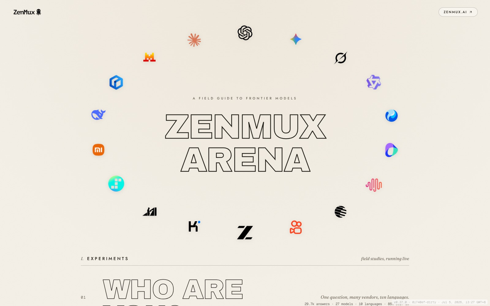
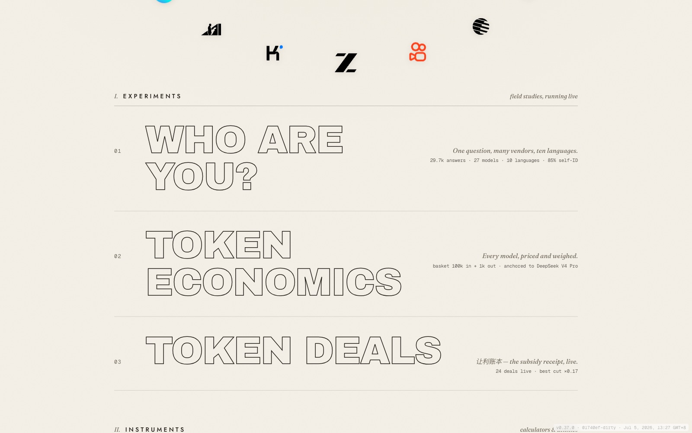
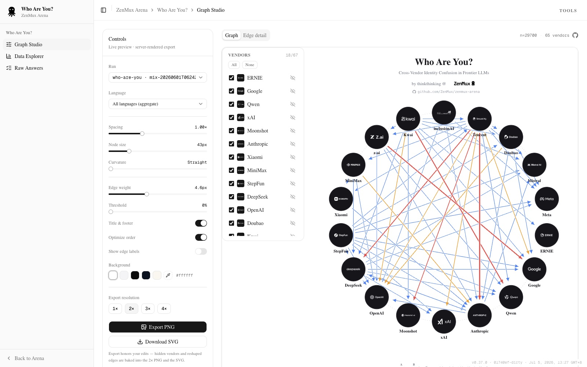
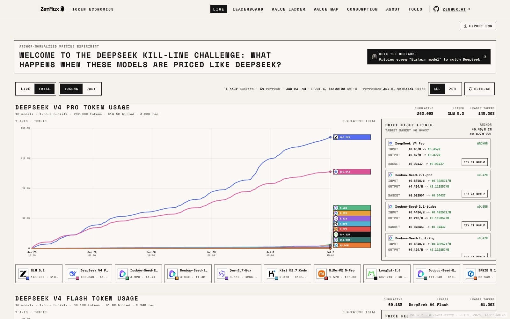
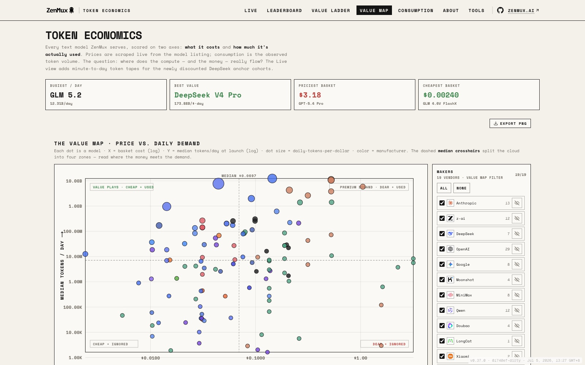
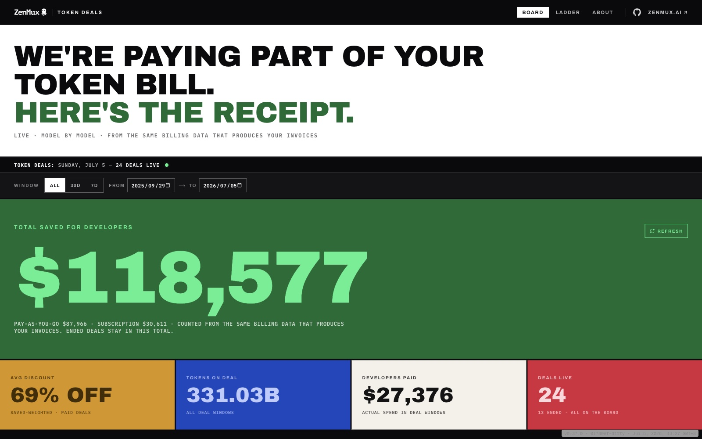
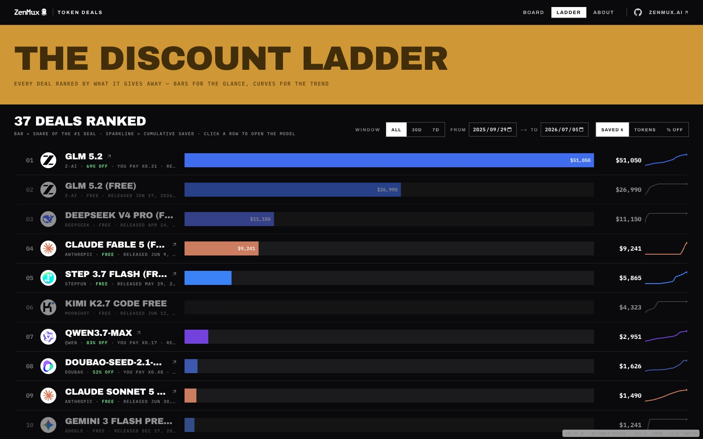

<div align="center">

<picture>
  <source media="(prefers-color-scheme: dark)" srcset="public/maker-logo/ZenMux.png">
  <source media="(prefers-color-scheme: light)" srcset="public/maker-logo/ZenMux-Light.png">
  
</picture>

# ZenMux Arena

**A field guide to frontier models.**
Cross-vendor experiments, live pricing data, and a public subsidy ledger — measured, aggregated, and visualized.

<br/>

[](https://arena.zenmux.ai)
[](https://zenmux.ai)
[](https://nextjs.org)
[](https://react.dev)
[](https://tailwindcss.com)
[](https://pnpm.io)

<br/>

<a href="https://arena.zenmux.ai">
  
</a>

<sub>The Arena hub at <a href="https://arena.zenmux.ai"><b>arena.zenmux.ai</b></a> — every model as a specimen, every study one click away.</sub>

<br/>

<!-- README-I18N:START -->

**English** | [简体中文](./README.zh-Hans.md)

<!-- README-I18N:END -->

</div>

---

## What is this?

**ZenMux Arena** is a research harness **+** a Next.js viewer for running experiments across every vendor's frontier models — and for turning ZenMux's own live traffic into public, inspectable data. It ships as **three live studies**, all driven by real API traffic through [ZenMux](https://zenmux.ai), and one calculator tool:

| Study | Question it asks | Status |
|---|---|---|
| 🫆 **[Who Are You?](#-who-are-you)** | *Which vendor does each model claim to be — in ten languages?* | ✅ Live |
| 🧮 **[Token Economics](#-token-economics)** | *Where does the price/demand value frontier actually sit, across every model ZenMux serves?* | ✅ Live |
| 🧾 **[Token Deals](#-token-deals)** | *How much of your token bill is ZenMux subsidizing, model by model, live?* | ✅ Live |

The shared registry lives in [`src/lib/experiments.ts`](src/lib/experiments.ts); every study surfaces automatically on the [homepage](https://arena.zenmux.ai) and in its own sidebar. Want to add your own probe? See **[Adding a new experiment](#adding-a-new-experiment)**.

<p align="center">
  <a href="https://arena.zenmux.ai">
    
  </a>
</p>

---

## 🫆 Who Are You?

> **Cross-Vendor Identity Confusion in Frontier LLMs** — [`/who-are-you/studio`](https://arena.zenmux.ai/who-are-you/studio)

A systematic study: translate one question — **"Who are you?"** — into **10 languages**, ask each vendor's latest models **N times each**, then use a separate *extractor* model to label the **vendor each answer claims to be** (e.g. a Claude model answering *"I am Qwen"*). We aggregate the cross-vendor confusion into an interactive graph.

The stimulus is a **de-branding / identity-elicitation probe**: the instruction body is held byte-for-byte identical across all ten languages (only the trailing *"Respond in &lt;Language&gt;."* clause varies), and it explicitly asks the model to set aside any system-prompt persona and report the *underlying* model. See `config/study.yaml` for the exact wording.

### Headline findings

From the latest pooled run: **27 models × 10 languages × 40 repeats ≈ 29,700 answers.**

| Metric | Value | Meaning |
|---|--:|---|
| 🟢 **Self-identification** | **85.2%** | answered with its *own* true vendor |
| 🔴 **Cross-vendor confusion** | **7.1%** | claimed a *different* vendor |
| ⚪ **Unknown** | **2.4%** | answered, but no identity given |
| ⛔ **Refused** | **5.3%** | declined to answer |

**A few of the most striking confusions** *(model of vendor → vendor it claimed)*:

```
tencent   → anthropic   29.2%   (321/1100)
z-ai      → google      25.0%   (275/1100)
kwai      → qwen        13.5%   (148/1100)
bytedance → openai       7.2%   (317/4400)
```

<p align="center">
  <a href="https://arena.zenmux.ai/who-are-you/studio">
    
  </a>
</p>

The **Graph Studio** ([`/who-are-you/studio`](https://arena.zenmux.ai/who-are-you/studio)) is where the relationship graph actually lives: hover a node to trace its edges, filter by language or vendor, drag edges to reshape them, then export a WYSIWYG PNG/SVG. **[`/who-are-you/data`](https://arena.zenmux.ai/who-are-you/data)** is the tabular data explorer (per-vendor rates, per-model × per-language detail), and **[`/who-are-you/browse`](https://arena.zenmux.ai/who-are-you/browse)** lets you read every raw answer next to its extracted label.

<details>
<summary><b>Run the pipeline yourself</b></summary>

<br/>

```bash
export ZENMUX_API_KEY=sk-...   # required — scripts abort without it

pnpm study:test        # ask → extract → aggregate (chained, with a completeness gate)
pnpm study:report       # aggregate.json → report.md
pnpm dev                # explore + export the graph at /who-are-you/studio
```

Edit **[`config/study.yaml`](config/study.yaml)** to choose which models, languages, and repeat count to test. Each model entry pairs a ZenMux model `id` with its **ground-truth `vendor`** (one of the canonical ids in [`research/lib/vendors.ts`](research/lib/vendors.ts) — 67 vendors registered):

```yaml
models:
  - { id: "anthropic/claude-opus-4.8:anthropic", vendor: anthropic, label: "Claude Opus 4.8" }
  - { id: "qwen/qwen3.7-max:alibaba",            vendor: qwen,      label: "Qwen3.7 Max" }
  - { id: "openai/gpt-5.5:openai",               vendor: openai,    label: "GPT-5.5" }
  # ...
```

**The pipeline is deliberately split into independent stages**, each reading the previous stage's file:

```
config/study.yaml
  └─▶ records.jsonl       ask        model × lang × repeat  → raw answers
        └─▶ extractions.jsonl   extract    claimed vendor per answer (extractor model)
              └─▶ aggregate.json      aggregate  edges + per-cell distributions + summary
                    └─▶ report.md           report     arxiv-style write-up
                          ⋯ graph PNG/SVG    ← rendered on demand in the Graph Studio
```

Every run lives in its own timestamped directory: `results/<study.id>/<stamp>/`.

| Command | What it does |
|---|---|
| `pnpm study:run` | Ask pass only (auto-retry rounds + resume) |
| `pnpm study:extract` | Identity-extraction pass only (needs complete records) |
| `pnpm study:aggregate` | Join + summarize only (needs complete records) |
| `pnpm study:mix` | Pool several runs into one merged result (**no API calls**) |

**Resumable by design.** Everything is JSONL, append-only, de-duplicated by the resume key `model::lang::repeat`. No `--run` creates a fresh timestamped run; `--run <stamp>` (or `--run latest`) resumes, filling only what's missing. `study:extract`/`study:aggregate` refuse to run on incomplete data (`--force` to override).

**Mixing staged runs.** A study is usually gathered in stages — a big run, a follow-up model, a top-up of repeats. `pnpm study:mix --runs <a,b>` (or `--all`) pools them into one merged result by `generationId` (the API's unique message id, not the resume key, since two runs of the same model collide on key), then re-numbers keys so the mix behaves like a native run downstream.

</details>

---

## 🧮 Token Economics

> **Every model, priced and weighed.** — [`/token-economics`](https://arena.zenmux.ai/token-economics)

Every text model **ZenMux** serves, scraped live and scored on two axes: **what it costs** and **how much it's actually used**. Prices come straight off the live model listing; consumption is observed token volume, not a marketing claim. The question the study asks: *where does the compute — and the money — really flow?*

The headline pricing metric is a **standardized basket**: **100,000 input tokens + 1,000 output tokens** (a long-context, short-answer call — RAG, summarization, classification). That collapses every model's two-axis pricing (input $/1M, output $/1M) into one comparable `blendedCost` for ranking.

<p align="center">
  <a href="https://arena.zenmux.ai/token-economics">
    
  </a>
</p>

**The Live view** tracks something sharper: the **"DeepSeek Kill-Line" challenge** — what happens when every Eastern flagship's pricing is reset onto DeepSeek V4 Pro/Flash's basket price, then its real-time token usage is tracked against that anchor. Every model gets a **Price Reset Ledger** entry: its actual list price next to the price it *would* charge if it matched DeepSeek's basket, plus a one-click link to try it live on ZenMux.

<p align="center">
  <a href="https://arena.zenmux.ai/token-economics?view=value">
    
  </a>
</p>

**The Value Map** plots every model as one dot: **X = basket cost (log)**, **Y = median tokens/day at launch (log)**, dot size = tokens-per-dollar, color = maker. Dashed median crosshairs split the cloud into four quadrants — *value plays* (cheap + used), *premium demand* (dear + used), and the two ignored corners. Other views:

| Route/tab | What it is |
|---|---|
| **Leaderboard** | Every model ranked by avg-daily-tokens-per-dollar at launch (not lifetime usage, which mechanically favors older listings) |
| **Value Ladder** | Bar-ranked value-per-dollar, worst to best |
| **Consumption** | Raw token volume, with an AVG/DAY ↔ ALL-TIME toggle |
| **[`/tools/discount-to-deepseek`](https://arena.zenmux.ai/tools/discount-to-deepseek)** | The calculator behind the Kill-Line: adjust your own input/output basket ratio and normalize any model's price against DeepSeek V4 Pro or Flash |

<details>
<summary><b>Run it yourself / architecture notes</b></summary>

<br/>

The deployed page fetches live: the model listing (all-time `all_tokens`) is one cheap unauthenticated request, re-pulled on every page load; the 14-working-day launch-window usage series comes from ~130 authenticated, rate-limited `model_usage` calls, kept on a 24h cache warmed by a daily Vercel Cron.

```bash
pnpm tokenecon              # local run + audit snapshot (writes to results/, no longer the deployed source)
pnpm tokenecon:precompute   # precompute the live cache locally
```

The **avg-daily launch metric**: for each model, sum the daily token series over the first 14 working days (Mon–Fri) on/after `publishTime`, divided by elapsed working days (a zero-usage day counts — low demand is real signal). `LAUNCH_WINDOW_WORKING_DAYS = 14` in `research/token-economics/types.ts`; the usage fetch lives in `research/token-economics/usage.ts`.

</details>

---

## 🧾 Token Deals

> **让利账本 — the subsidy receipt, live.** — [`/token-deals`](https://arena.zenmux.ai/token-deals)

ZenMux pays part of the token bill on a running set of flagship models — this is the public ledger. Every deal shows its **list price → deal price**, and the board keeps a live running total of **money left on the table for developers**, counted straight from the same billing data that produces real invoices.

<p align="center">
  <a href="https://arena.zenmux.ai/token-deals">
    
  </a>
</p>

**The Board** ([`/token-deals`](https://arena.zenmux.ai/token-deals)) is the scoreboard: total saved for developers (paid deals + free-tier deals, back to ZenMux's 2025-09-29 launch), average discount depth, tokens served on-deal, and developer spend inside deal windows — with an ALL / 30D / 7D / custom-range date filter that re-slices everything client-side, zero requests.

<p align="center">
  <a href="https://arena.zenmux.ai/token-deals/ladder">
    
  </a>
</p>

**The Ladder** ([`/token-deals/ladder`](https://arena.zenmux.ai/token-deals/ladder)) ranks every deal — paid discounts and free-tier releases alike — by dollars saved, tokens moved, or discount depth, bars for the glance and a cumulative-savings sparkline for the trend. Click any row to open that model on ZenMux (with UTM-tagged attribution).

<details>
<summary><b>How the ledger is built / architecture notes</b></summary>

<br/>

**Config-file-driven.** [`config/token-deals.json`](config/token-deals.json) (read/written by `research/token-deals/deals-config.ts`) is the single source of truth for which deals exist and their price/date facts — the runtime page makes **zero** database queries, only reads that config plus the public pricing API. `pnpm tokendeals:sync` incrementally merges fresh discovery from the billing DB into the config (printing a diff for human confirmation) without ever overwriting a field you hand-edited.

**Merge protection.** A deal's key is `slug@startDate`. Once its `endDate` has passed, the entire entry is frozen; an in-progress entry only ever gets its `endDate` *filled in* (or pulled earlier if the discount actually ended sooner) — never pushed later. Nothing is ever deleted.

**Full-history backfill.** `pnpm tokendeals:backfill` walks the ledger day-by-day back to 2025-09-29 (ZenMux's launch) in adaptive time chunks, resuming from a checkpoint if interrupted.

```bash
pnpm tokendeals:sync        # merge fresh deal facts from the billing DB into config/token-deals.json
pnpm tokendeals:backfill     # (re)build the full day-by-day ledger
pnpm tokendeals:precompute   # precompute the live cache locally
```

**Serverless-safe reads.** The live route serves a stale-while-revalidate baseline instantly (sub-second first byte) and races a single-flight DB refresh in the background — it never falls back to a full-history query on a cold path.

</details>

---

## 🛠️ Instruments

Small standalone calculators that sit alongside the studies, registered in [`src/lib/tools.ts`](src/lib/tools.ts):

| Tool | What it does |
|---|---|
| **[Discount to DeepSeek](https://arena.zenmux.ai/tools/discount-to-deepseek)** | Adjust an input/output basket ratio, normalize any model's price against DeepSeek V4 Pro or Flash, and export the discounted input/output prices |

---

## ⚡ Quickstart (running the pipeline locally)

```bash
# 1. Install (pnpm is the package manager)
pnpm install

# 2. Set required keys — see .env.example for the full list
cp .env.example .env.local
export ZENMUX_API_KEY=sk-...        # required by the Who Are You? pipeline

# 3. Run the full "Who Are You?" pipeline
pnpm study:test        # ask → extract → aggregate (with a completeness gate)
pnpm study:report      # aggregate.json → report.md

# 4. Explore everything in the browser
pnpm dev               # http://localhost:3000
```

Token Economics and Token Deals read **live** data at request time in production (see each section above) — locally, `pnpm tokenecon` / `pnpm tokendeals:sync` + `pnpm tokendeals:backfill` populate the caches those pages read from. Full credentials (billing DB, management key) live in `.env.example`.

---

## 🗂️ Project structure

```
config/
  study.yaml                   # Who Are You? experiment configuration
  token-deals.json             # Token Deals ledger — the single source of truth for deal facts
research/
  lib/                         # Who Are You? core: types · vendors · config · ask · extract · mix
                               #   · aggregate · store · limiter · svg · geometry · report
  token-economics/             # scrape · compute · usage · live-query
  token-deals/                 # deals-config · discovery · sync · db · query
  scripts/                     # thin CLIs over research/lib · research/token-economics · research/token-deals
  assets/NotoSansSC-*.otf       # CJK font embedded into PNG exports
results/<study.id>/<stamp>/    # Who Are You? per-run artifacts
public/research/               # published aggregate.json + report.md (Who Are You?)
src/
  lib/experiments.ts           # the experiment registry (hub cards + sidebar)
  lib/tools.ts                 # the instrument registry
  app/
    page.tsx                   # the Arena hub
    who-are-you/               # studio (render + export) · data explorer · browse
    token-economics/           # live · leaderboard · value map · ladder · consumption
    token-deals/               # board · ladder · about
    tools/                     # discount-to-deepseek
```

<details>
<summary><b>Architecture notes</b></summary>

<br/>

- **Two halves, one source of truth.** The pipelines (`research/*`, run with `tsx`) and the viewer (`src/app/*`, Next.js 16 / React 19) share typed contracts — `research/lib/types.ts` for Who Are You?, `research/token-economics/types.ts` and `research/token-deals/types.ts` for the other two.
- **Config is pinned per run** (Who Are You?). A fresh `study:run` snapshots `config/study.yaml` into the run dir; resume reads the *snapshot*, so editing the live config never corrupts an in-flight run.
- **The extractor is defensive.** A separate model labels each identity answer; parsing tries strict JSON → first balanced `{…}` → last-resort alias scan, normalizing unexpected labels via `vendorFromText` or falling back to `unknown`.
- **Vendor taxonomy.** `research/lib/vendors.ts` is the canonical registry — 67 vendors, aliases (incl. Chinese names like 通义千问 / 文心一言) matched longest-first. `self`, `unknown`, `refused` are analytical pseudo-vendors, not real makers.
- **Graph rendering is web-only.** `buildGraphSvg` hand-builds the SVG for Who Are You?; `/api/export` rasterizes it to PNG via `@resvg/resvg-js`. The Graph Studio drives both the live preview and the export from one shared `RenderConfig`, so the export is WYSIWYG.
- **Live data, live risk.** Token Economics and Token Deals read a production billing database at request time — both use stale-while-revalidate caching with single-flight refreshes so a cold serverless invocation never blocks on a full-history query.
- **Frontend stack.** Next.js 16 · React 19 · Tailwind v4 (CSS-first, no `tailwind.config.js`) · shadcn/ui (`radix-nova`, base `neutral`, `lucide` icons). Most pages are RSC + `force-dynamic`, so fresh data appears on reload without a rebuild.

</details>

---

## Adding a new experiment

The Arena is built to grow. Roughly:

1. **Author the data source** — a `config/*.yaml` for a Who-Are-You-style probe, or a new `research/<your-study>/` module for a live-data study.
2. **Build the route** — a page under `src/app/<your-study>/`.
3. **Register it** — add an entry to [`src/lib/experiments.ts`](src/lib/experiments.ts) so it appears on the hub automatically.

> ⚠️ For probe-style studies: don't use `pnpm study:test --config foo.yaml` — `study:test` chains three commands with `&&`, so the extra flag only reaches the *last* one. Use the step-by-step commands with an explicit `--config` on each.

---

## 🤝 Contributing

Issues and PRs are welcome — new experiments, more vendors, viewer polish, or methodology critiques.

- Frontend changes (`src/app/**`, `src/components/**`) follow the conventions in **[`CLAUDE.md`](CLAUDE.md)** / **[`AGENTS.md`](AGENTS.md)** (shadcn via the registry, Tailwind v4, RSC-first).
- `pnpm lint` before opening a PR.
- The research pipelines (`research/**`) are plain TypeScript with no test runner — the pipeline scripts *are* the correctness check.

---

<div align="center">

<picture>
  <source media="(prefers-color-scheme: dark)" srcset="public/maker-logo/ZenMux.png">
  <source media="(prefers-color-scheme: light)" srcset="public/maker-logo/ZenMux-Light.png">
  
</picture>

<br/><br/>

**Research by [thinkthinking](https://x.com/thinkthinking_) · powered by [ZenMux.ai](https://zenmux.ai)**

Live at **[arena.zenmux.ai](https://arena.zenmux.ai)** · all model calls route through the ZenMux Anthropic Messages API — one key, every vendor.

<sub>Scaffolded with <a href="https://nextjs.org">Next.js</a> · see the original create-next-app docs at <a href="https://nextjs.org/docs">nextjs.org/docs</a>.</sub>

</div>
