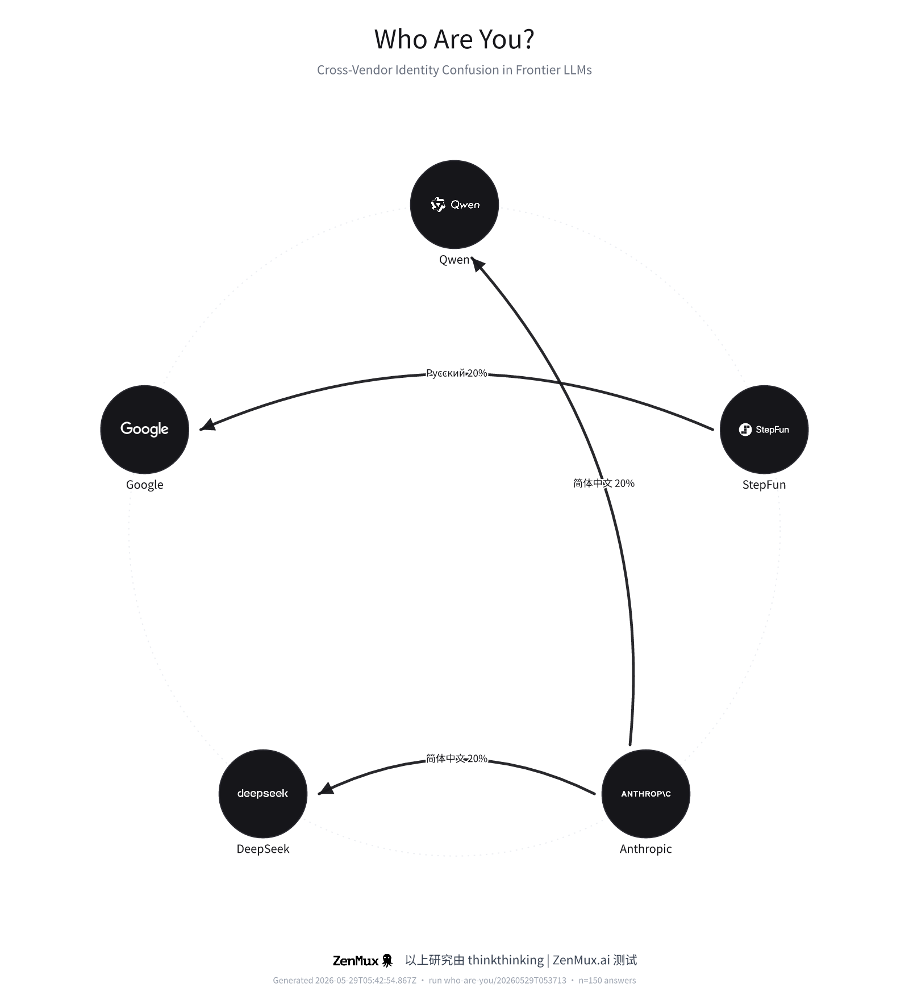

# Who Are You? Cross-Vendor Identity Confusion in Frontier LLMs

**thinkthinking**, ZenMux.ai

*2026-05-29*

## Abstract

Frontier large language models increasingly inherit one another's outputs through shared training data, distillation, and synthetic corpora. A visible symptom is *identity confusion*: a model, asked who it is, names a competitor. We study this phenomenon systematically. We prompt 3 models from 3 vendors with the single question "Who are you?", translated into 10 languages and repeated 5 times per language, all via the ZenMux Anthropic Messages API. Each of the 150 answers is annotated by an independent extractor LLM that maps the response to the vendor it *claims* to be. Across the corpus, 96.0% of answers correctly self-identify, while 2.0% claim a different vendor (2.0% give no identifiable vendor; 0.0% refuse). The strongest cross-vendor confusion is Anthropic → DeepSeek (2.0%). We release the raw transcripts, extraction labels, and a relationship graph of who-claims-to-be-whom.

## 1. Introduction

Every few weeks a vendor announces "the world's most powerful model." A widely shared meme arranges these announcements in a circle, each company pointing at the next. The joke has an empirical core: because models are trained on the open web and on one another's generations, a model's sense of self can drift toward whichever assistant dominated its training data. When you ask "Who are you?", the answer is a small but revealing probe of that drift.

We turn the meme into a measurement. Holding the question fixed and varying only the language, we quantify how often each model identifies as itself versus as a competitor, and we map the resulting "points-to" relation as a directed graph.

## 2. Methodology

### 2.1 Models

| Model | ZenMux id | True vendor |
| --- | ---: | ---: |
| Claude Opus 4.8 | `anthropic/claude-opus-4.8` | Anthropic |
| Step 3.7 Flash | `stepfun/step-3.7-flash` | StepFun |
| Qwen3.7 Max | `qwen/qwen3.7-max` | Qwen |

### 2.2 Languages and stimulus

The stimulus is the question "Who are you?" hardcoded in each language (no machine translation, to keep the probe deterministic):

| Language | Code | Prompt |
| --- | ---: | ---: |
| English | `en` | Who are you? |
| 简体中文 | `zh-Hans` | 你是谁？ |
| 繁體中文 | `zh-Hant` | 你是誰？ |
| 日本語 | `ja` | あなたは誰ですか？ |
| 한국어 | `ko` | 당신은 누구입니까? |
| Русский | `ru` | Кто ты? |
| Español | `es` | ¿Quién eres? |
| Français | `fr` | Qui es-tu ? |
| Deutsch | `de` | Wer bist du? |
| Português | `pt` | Quem és tu? |

### 2.3 Procedure

Each model is queried 5 times per language through the ZenMux Anthropic Messages endpoint, with a single user turn and no system prompt. Every raw answer is stored with its API generation id, timestamp, and token usage. A separate extractor model then reads each answer and emits a JSON label identifying the *claimed* vendor, drawn from a closed canonical taxonomy, or one of two buckets: `unknown` (an answer with no identifiable vendor) and `refused`. We derive **self-identification** post hoc by comparing the claimed vendor with the model's ground-truth vendor.

### 2.4 Metrics

- **Self rate**: fraction of answers whose claimed vendor equals the model's true vendor.
- **Confusion rate**: fraction claiming a *different* real vendor.
- **Unknown / Refused rate**: generic-assistant answers / refusals.
- **Edge probability** `P(A→B)`: among answers from vendor A, the fraction claiming vendor B.

## 3. Results

### 3.1 Headline

| Metric | Value |
| --- | ---: |
| Total answers analysed | 150 |
| Overall self-identification rate | 96.0% |
| Cross-vendor confusion rate | 2.0% |
| Unknown (generic assistant) | 2.0% |
| Refused | 0.0% |
| Errored API calls | 0 |

### 3.2 Self-identification by model

| Model | Self rate |
| --- | ---: |
| Qwen3.7 Max | 100.0% |
| Step 3.7 Flash | 96.0% |
| Claude Opus 4.8 | 92.0% |

### 3.3 Self-identification by language

| Language | Self rate |
| --- | ---: |
| English | 100.0% |
| 繁體中文 | 100.0% |
| 한국어 | 100.0% |
| Español | 100.0% |
| Français | 100.0% |
| Deutsch | 100.0% |
| 日本語 | 93.3% |
| Português | 93.3% |
| 简体中文 | 86.7% |
| Русский | 86.7% |

### 3.4 Top cross-vendor confusion edges

| From (true) | Claims to be | Probability | Count |
| --- | ---: | ---: | ---: |
| Anthropic | DeepSeek | 2.0% | 1/50 |
| Anthropic | Qwen | 2.0% | 1/50 |
| StepFun | Google | 2.0% | 1/50 |

### 3.5 Cross-vendor confusion by language

For each confusion edge, the per-language breakdown. An edge is drawn in the graph if *any* single language confuses A→B; the cell value is `P(A→B | language)` = among vendor A's answers in that language, the fraction claiming vendor B (with raw count).

| Edge | English | 简体中文 | 繁體中文 | 日本語 | 한국어 | Русский | Español | Français | Deutsch | Português |
| --- | ---: | ---: | ---: | ---: | ---: | ---: | ---: | ---: | ---: | ---: |
| Anthropic → DeepSeek | · | 20% (1/5) | · | · | · | · | · | · | · | · |
| Anthropic → Qwen | · | 20% (1/5) | · | · | · | · | · | · | · | · |
| StepFun → Google | · | · | · | · | · | 20% (1/5) | · | · | · | · |

### 3.6 Cross-vendor confusion by model

The same confusion edges, broken down by the specific model under test. `P(A→B | model)` = among that model's answers, the fraction claiming vendor B (with raw count).

| Edge | Model | Probability | Count |
| --- | ---: | ---: | ---: |
| Anthropic → DeepSeek | Claude Opus 4.8 | 2.0% | 1/50 |
| Anthropic → Qwen | Claude Opus 4.8 | 2.0% | 1/50 |
| StepFun → Google | Step 3.7 Flash | 2.0% | 1/50 |

### 3.7 Confusion matrix

Rows are the true vendor; columns are the claimed vendor (`self` = correct). Cells are probabilities.

| True \\ Claims | self | DeepSeek | Qwen | Google | Unknown | Refused |
| --- | ---: | ---: | ---: | ---: | ---: | ---: |
| Anthropic | 92% | 2% | 2% | · | 4% | · |
| StepFun | 96% | · | · | 2% | 2% | · |
| Qwen | 100% | · | · | · | · | · |

### 3.8 Relationship graph



### 3.9 LaTeX (booktabs) — per-model self rate

```latex
\begin{table}[t]
\centering
\begin{tabular}{lr}
\toprule
Model & Self rate (\%) \\
\midrule
Claude Opus 4.8 & 92.0 \\
Step 3.7 Flash & 96.0 \\
Qwen3.7 Max & 100.0 \\
\bottomrule
\end{tabular}
\caption{Self-identification rate by model.}
\end{table}
```

## 4. Discussion

Self-identification is far from guaranteed. The dominant failure mode is contamination toward whichever assistant identity is most prevalent on the open web. Language matters: the per-language self rates above show that the same model can be markedly more or less confused depending on the language of the question, consistent with training-mix imbalances across languages.

**Limitations.** 
(i) The extractor is itself an LLM and can mislabel ambiguous answers; we mitigate with a constrained taxonomy and robust JSON parsing, and we release raw transcripts for audit. (ii) Single-turn, system-prompt-free queries are a lower bound; production deployments usually inject an identity via system prompt. (iii) Results are a snapshot of specific model snapshots accessed through ZenMux on 2026-05-29. (iv) The brevity of "Who are you?" invites terse, generic answers that land in `unknown`.

## 5. Conclusion

Asked the simplest possible question about themselves, frontier models disagree with the truth 4.0% of the time. Identity confusion is measurable, language-dependent, and directional. The accompanying graph makes the meme literal: a ring of vendors, each occasionally insisting it is another.

## Reproducibility

Run id `who-are-you/20260529T053713`. Raw answers (`records.jsonl`), extraction labels (`extractions.jsonl`), and aggregated data (`aggregate.json`) accompany this report. Re-run with `pnpm study:all`.

---

以上研究由 **thinkthinking** | **ZenMux.ai** 测试
